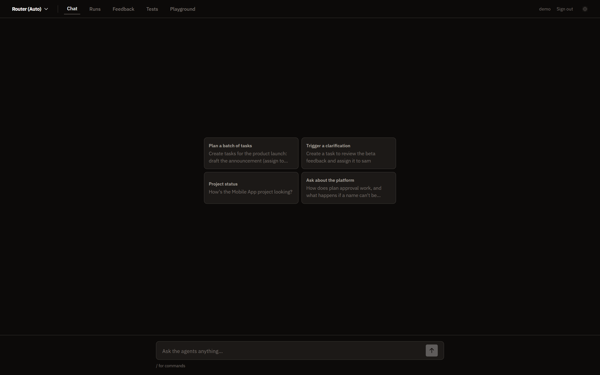
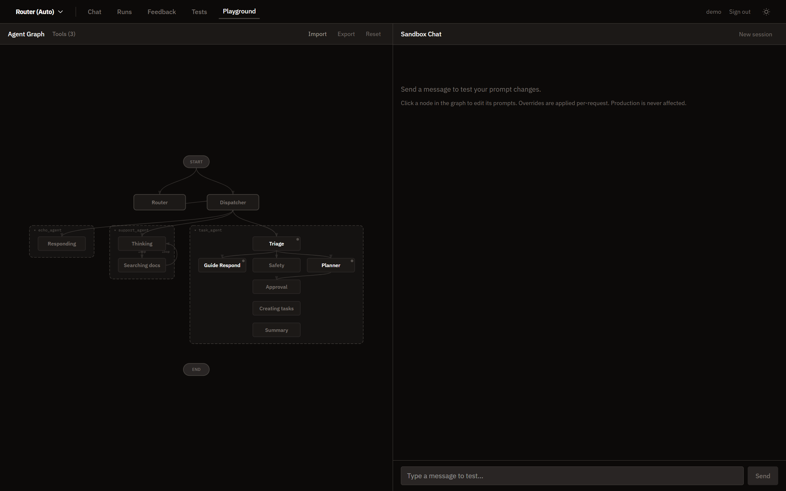

# Agentic SaaS Starter

[](https://github.com/Arty2001/agentic-saas-starter/actions/workflows/python-test.yml)
[](https://github.com/Arty2001/agentic-saas-starter/actions/workflows/frontend-build.yml)


**Turn the SaaS you already have into an agent platform.**

Every SaaS is being asked the same question right now: *"can I just tell it what I want?"* This repo is a working answer — the complete agent layer that goes **on top of** an existing product, not a rewrite of it.



## The concept

Converting a SaaS to agents isn't about calling a chat API. It's four architectural decisions, and this template takes a position on each:

**1. Agent tools are your existing API.**
An agent "tool" here is a thin wrapper around a REST endpoint your product already exposes. No parallel business logic, no second source of truth. Point `SAAS_API_URL` at your backend and the agent operates your product the same way your frontend does. Until you do, every tool runs an in-process mock that produces identical responses — so the entire platform works offline, from first clone.

**2. The agent never owns identity.**
Users log in with your SaaS's own tokens; the agent layer validates them against your identity service and forwards them on every tool call. Your API keeps enforcing its own permissions — the agent adds convenience, never privilege.

**3. Nothing destructive happens without a human.**
Free text becomes a **typed plan** the user approves before anything runs. Approved items execute **in parallel**, and when a tool can't resolve something ("assign it to sam" — which Sam?) the run **pauses mid-flight**, asks, and resumes exactly where it stopped. All of it survives crashes, because state is checkpointed in Postgres.

**4. Agents and tools are folders, not wiring.**
An agent is a folder: a `description.yaml` the router reads and a `graph.py` that builds it. A tool is a folder: a `run()`, a Pydantic schema, and a `prompt.yaml` with few-shots. Drop one in and it's discovered at startup — routable, rendered in the playground, targetable by evals — with **zero changes to core files**. `python -m agent_platform new-agent billing_agent` scaffolds one in seconds, and the three bundled agents are graduated templates to copy from: `echo_agent` (one node) → `support_agent` (ReAct loop) → `task_agent` (full plan-and-execute). Your tenth agent costs the same as your first.

Around that core sits everything a team actually needs to ship: an LLM **router** choosing between specialized agents, **observability** (every run, step, tool call, and token persisted and browsable), a multi-turn **eval harness** (scripted conversations, versioned baselines, structural diffs, LLM judge), and a **prompt playground** that re-runs any node against real history without redeploying.



## What's in the box

| | |
|---|---|
| `task_agent` | The flagship: triage → plan → **approve** → parallel fan-out → clarify → summarize |
| `support_agent` | ReAct loop that answers questions from a knowledge base, with citations |
| `echo_agent` | The smallest possible agent — your copy-me starting point |
| Dev console | React app: chat, run traces, eval suites, live graph playground |
| Eval harness | Multi-turn scripted tests with baselines, structural diff + LLM judge |
| Scaffolding | `python -m agent_platform new-agent` / `new-tool` |
| Demo domain | A tiny task tracker — small enough to read in one sitting, complete enough to exercise every pattern |

## Quickstart

```bash
export OPENAI_API_KEY=sk-...     # or any OpenAI-compatible endpoint (vLLM, LM Studio)
docker compose up --build
```

Open [http://localhost:8080](http://localhost:8080), log in with any username/password (dev auth mode), leave the agent picker on **router**, and try:

> Create tasks for the launch: draft the announcement (assign to sam), update the pricing page (Priya), QA pass (Jordan) — all due Friday.

You'll approve a plan, watch tasks create in parallel, and get asked which "Sam" you meant — the mock roster has two, on purpose. Then ask *"How does plan approval work?"* and watch the router hand you to the support agent instead.

<details>
<summary><b>Local development (hot reload)</b></summary>

```bash
docker compose up db -d                # Postgres only

pip install -e ".[dev]"
cp .env.example .env                   # set OPENAI_API_KEY
python -m agent_platform               # backend  (or: uvicorn agent_platform.api.app:app --port 8080 --reload)

cd frontend && npm install && npm run dev   # console
```

With `IS_DEV=true` the schema creates itself; production applies [MIGRATIONS.md](MIGRATIONS.md). Quality gates:

```bash
ruff check agent_platform tests && mypy agent_platform && pytest
```

</details>

## Making it yours

1. **Swap the API** — replace the demo endpoints in [`saas_api_client.py`](agent_platform/services/saas_api_client.py) with your product's; structured 4xx payloads become clarification prompts for free.
2. **Swap the auth** — set `AUTH_SERVICE_URL`; the layer validates the tokens your product already issues.
3. **Swap the tools** — one small folder each ([guide](docs/how-to-add-a-tool.md)); keep the real/mock split and the clarification envelope, and the UI keeps working untouched.
4. **Reshape the flagship** — swap the planner's task fields for your domain's; the prompts document which patterns to keep ([task_agent](agent_platform/agents/task_agent)).
5. **Swap the knowledge** — drop your product docs into [`knowledge/`](agent_platform/knowledge) and the support agent becomes your in-product help.

Then script your critical conversations in the **Tests** view so prompt and model changes can never silently regress them.

## Learn more

- [Architecture](docs/architecture.md) — the full diagram and a problem → solution → file map
- [How to add a tool](docs/how-to-add-a-tool.md) · [How to add an agent](docs/how-to-add-an-agent.md)
- [Migrations](MIGRATIONS.md) · [Changelog](CHANGELOG.md) · [Contributing](CONTRIBUTING.md) · [Security](SECURITY.md)

## License

[MIT](LICENSE)
