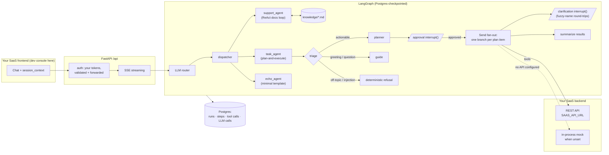

# Agentic SaaS Starter

    

**A template for turning an existing SaaS into an agent-as-a-service platform.**

Your SaaS already has a REST API, an identity service, and a frontend. This repo is the agent layer that goes on top: LangGraph orchestration behind FastAPI, a React dev console, an observability pipeline, and an eval harness — wired so that **agent tools are calls to your existing API**, **auth is your existing tokens forwarded**, and **everything runs fully mocked** with zero external services beyond Postgres.

The bundled demo domain is a deliberately tiny task tracker — small enough to read in one sitting, complete enough to exercise every pattern. Swap its nouns for your product's; the architecture is the point.



## Why this is the hard part of "adding AI to a SaaS"

Anyone can call a chat API. The engineering is in everything around it, and that's what this template ships:

| Problem | Solution here | Where |
|---|---|---|
| One chat box, several specialized agents | LLM router picks from registry descriptions + routing hints; frontend can also pin an agent | [graph/nodes/router.py](agent_platform/graph/nodes/router.py), [agents/\*/description.yaml](agent_platform/agents) |
| Free-text → typed, executable plan | Planner with a strict JSON contract + `needs_info` branch | [task_agent/prompts.py](agent_platform/agents/task_agent/prompts.py), [nodes.py](agent_platform/agents/task_agent/nodes.py) |
| Questions need grounding, not vibes | ReAct loop over a searchable knowledge base, cited answers, bounded search rounds | [support_agent/](agent_platform/agents/support_agent), [tools/search_knowledge/](agent_platform/tools/search_knowledge) |
| Don't run work unapproved | Human-in-the-loop `interrupt()` before execution | [task_agent/nodes.py](agent_platform/agents/task_agent/nodes.py) `present_plan` |
| N plan items shouldn't run serially | Map-reduce fan-out via the `Send` API, each item its own branch sub-graph | [task_agent/graph.py](agent_platform/agents/task_agent/graph.py), [branch.py](agent_platform/agents/task_agent/branch.py) |
| Users say "sam", your API knows two Sams | Fuzzy matching + a self-describing clarification envelope (`answerKey`, `suggestedOptions`), mid-run `interrupt()`, bounded retries | [tools/matching.py](agent_platform/tools/matching.py), [tools/create_task/](agent_platform/tools/create_task), [branch.py](agent_platform/agents/task_agent/branch.py) |
| A crash mid-plan must not lose state | Postgres-backed LangGraph checkpointing; only the interrupted node replays | [db/checkpointer.py](agent_platform/db/checkpointer.py) |
| Prompt injection / off-topic abuse | Triage routes to a **hardcoded** refusal no input can steer | [task_agent/nodes.py](agent_platform/agents/task_agent/nodes.py) `safety_respond` |
| "What did the agent actually do?" | Callback handler persists runs, steps, tool calls, LLM calls, tokens | [observability/callback.py](agent_platform/observability/callback.py) |
| "Did yesterday's prompt change break anything?" | Multi-turn eval harness: scripted turns, baseline snapshots, structural diff + LLM judge | [regression/](agent_platform/regression) |
| Iterating on prompts without redeploying | Playground: edit any node's system prompt, re-run against real history | [api/routes/playground.py](agent_platform/api/routes/playground.py) |
| New tools/agents without wiring | Filesystem-convention registries: drop a folder, it's discovered | [tools/registry.py](agent_platform/tools/registry.py), [agents/registry.py](agent_platform/agents/registry.py) |
| Multi-tenancy | tenant → workspace addressing, per-tenant LLM config, tokens forwarded so your API enforces its own permissions | [services/saas_api_client.py](agent_platform/services/saas_api_client.py), [api/routes/tenant/](agent_platform/api/routes/tenant) |

## Quickstart

```bash
docker compose up --build
```

That's it — Postgres + backend + built-in console on [http://localhost:8080](http://localhost:8080). Add an `OPENAI_API_KEY` to your environment first (or point `DEFAULT_LLM_BASE_URL` at any OpenAI-compatible endpoint — vLLM, LM Studio, …). Log in with any username/password (dev auth mode) and try, with the agent picker on **router**:

> Create tasks for the launch: draft the announcement (assign to sam), update the pricing page (Priya), QA pass (Jordan) — all due Friday.

The router picks **task_agent**; you'll see the plan card, approve it, watch the tasks create in parallel — and get a clarification prompt asking which "Sam" you meant (the mock roster has two). Then:

> How does plan approval work?

The router picks **support_agent**, which searches the bundled docs and answers with citations.


Every agent's live graph renders in the Playground, where any node's system prompt can be edited and re-run against real history:


*(Regenerate these anytime with `npm run screenshots` in `frontend/` while the app is running.)*

### Local development

```bash
# 1. Postgres
docker compose up db -d

# 2. Backend
pip install -e ".[dev]"
cp .env.example .env      # set OPENAI_API_KEY
python -m agent_platform                                  # or, with hot reload:
uvicorn agent_platform.api.app:app --port 8080 --reload   # (on Windows, prefer one of these two exact commands —
                                                          #  psycopg async needs the selector event loop they set up)

# 3. Console (hot reload)
cd frontend && npm install && npm run dev
```

With `IS_DEV=true` the observability tables are created automatically; production applies [MIGRATIONS.md](MIGRATIONS.md). With no `SAAS_API_URL`, every tool uses its mock branch — the full plan → approve → fan-out → clarify loop works end to end offline.

```bash
pytest                        # unit tests run anywhere; integration tests self-skip without Postgres
ruff check agent_platform tests
mypy agent_platform           # type-check gate (also runs in CI)
```

### Scaffolding

```bash
python -m agent_platform new-agent billing_agent
python -m agent_platform new-tool create_invoice --category billing
```

Both drop registry-ready skeletons — restart the server and they're discovered, routable, rendered in the playground, and targetable by evals.

## Project structure

```
agent_platform/       Python package (backend)
  api/                FastAPI routes + SSE streaming (chat, runs, playground, evals)
  agents/             Auto-discovered agent subgraphs
    task_agent/         flagship: triage → plan → approve → parallel fan-out → summarize
    support_agent/      ReAct loop: searches the bundled docs, answers with citations
    echo_agent/         minimal: the smallest agent the registry can discover
  db/                 SQLAlchemy engine, Postgres LangGraph checkpointer, observability models
  graph/              Core orchestration (LLM router → dispatcher) + shared AgentState
  knowledge/          The platform's own docs — what support_agent searches
  llm/                Provider-agnostic LLM factory (OpenAI / Anthropic / DeepSeek / vLLM)
  observability/      Callback handler that persists runs, steps, tool + LLM calls
  regression/         The eval engine behind the Tests view (executor, differ, LLM judge)
  tools/              Auto-discovered tools — each: __init__.py (run), schemas.py, prompt.yaml
  services/           SaasApiClient — the bridge to YOUR SaaS's REST API
  auth.py             Token validation against YOUR identity service (+ dev mode)
  config.py           Pydantic settings from env / .env
frontend/             React dev console (Vite + TS) — chat, run traces, playground, eval suites
docs/                 How to add a tool / an agent
compose.yaml          Postgres + app, one command
```

## Making it yours

1. **Point the client at your API** — set `SAAS_API_URL` and replace the demo endpoints in [saas_api_client.py](agent_platform/services/saas_api_client.py) with your product's. Structured 4xx payloads become clarification prompts for free.
2. **Forward your auth** — set `AUTH_SERVICE_URL`; the agent layer validates the same token your product issues and forwards it on every tool call, so your API keeps enforcing its own permissions.
3. **Replace the demo tools** — a tool is one small folder with a real branch, a mock branch, and a schema ([guide](docs/how-to-add-a-tool.md)). Keep the clarification envelope (`answerKey` + `suggestedOptions`) and the UI keeps working untouched.
4. **Reshape the flagship agent** — [task_agent](agent_platform/agents/task_agent) is the plan-and-execute skeleton: swap the planner prompt's task fields for your domain's, and keep the patterns its prompts document (triage tie-breakers, capability ceilings, pass-through fuzzy names, safe defaults over questions).
5. **Feed session context from your frontend** — your UI sends `session_context` (tenant, workspace, a `payload` snapshot like `{team, projects}`) with each chat request; planners ground themselves in the user's real entity names and never invent options.
6. **Write your evals** — script your critical conversations in the Tests view, promote baselines, and let the structural diff + LLM judge catch regressions when prompts or models change.
7. **Replace the knowledge base** — drop your product docs into [knowledge/](agent_platform/knowledge) and support_agent becomes your in-product help.

## Self-hosted LLM (optional)

Any OpenAI-compatible endpoint works. Example with vLLM:

```bash
docker run -d --runtime nvidia --gpus all \
  -v ~/.cache/huggingface:/root/.cache/huggingface \
  -p 8000:8000 --ipc=host \
  vllm/vllm-openai:latest \
  Qwen/Qwen3-30B-A3B-Instruct-2507 \
  --served-model-name local-agent \
  --port 8000 --max-model-len 32768 \
  --enable-auto-tool-choice --tool-call-parser hermes
```

```bash
DEFAULT_LLM_PROVIDER=vllm
DEFAULT_LLM_MODEL=local-agent
DEFAULT_LLM_BASE_URL=http://localhost:8000/v1
```

## Docs

- [How to add a tool](docs/how-to-add-a-tool.md) · [How to add an agent](docs/how-to-add-an-agent.md)
- [Database migrations](MIGRATIONS.md) · [Changelog](CHANGELOG.md)
- [Contributing](CONTRIBUTING.md) · [Security](SECURITY.md)
- In-repo: [knowledge/](agent_platform/knowledge) — the same docs support_agent serves in chat

## License

[MIT](LICENSE)
