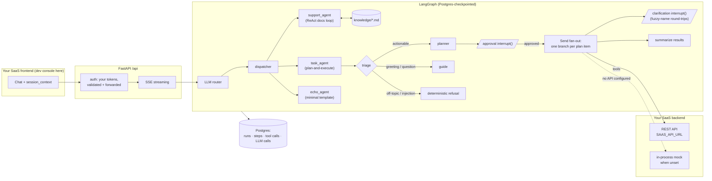

# Architecture

How the agent layer fits around an existing SaaS, and where each hard
problem is solved.



## Problem → solution map

Anyone can call a chat API. The engineering is in everything around it:

| Problem | Solution here | Where |
|---|---|---|
| One chat box, several specialized agents | LLM router picks from registry descriptions + routing hints; frontend can also pin an agent | [graph/nodes/router.py](../agent_platform/graph/nodes/router.py), [agents/\*/description.yaml](../agent_platform/agents) |
| Free-text → typed, executable plan | Planner with a strict JSON contract + `needs_info` branch | [task_agent/prompts.py](../agent_platform/agents/task_agent/prompts.py), [nodes.py](../agent_platform/agents/task_agent/nodes.py) |
| Questions need grounding, not vibes | ReAct loop over a searchable knowledge base, cited answers, bounded search rounds | [support_agent/](../agent_platform/agents/support_agent), [tools/search_knowledge/](../agent_platform/tools/search_knowledge) |
| Don't run work unapproved | Human-in-the-loop `interrupt()` before execution | [task_agent/nodes.py](../agent_platform/agents/task_agent/nodes.py) `present_plan` |
| N plan items shouldn't run serially | Map-reduce fan-out via the `Send` API, each item its own branch sub-graph | [task_agent/graph.py](../agent_platform/agents/task_agent/graph.py), [branch.py](../agent_platform/agents/task_agent/branch.py) |
| Users say "sam", your API knows two Sams | Fuzzy matching + a self-describing clarification envelope (`answerKey`, `suggestedOptions`), mid-run `interrupt()`, bounded retries | [tools/matching.py](../agent_platform/tools/matching.py), [tools/create_task/](../agent_platform/tools/create_task), [branch.py](../agent_platform/agents/task_agent/branch.py) |
| A crash mid-plan must not lose state | Postgres-backed LangGraph checkpointing; only the interrupted node replays | [db/checkpointer.py](../agent_platform/db/checkpointer.py) |
| Prompt injection / off-topic abuse | Triage routes to a **hardcoded** refusal no input can steer | [task_agent/nodes.py](../agent_platform/agents/task_agent/nodes.py) `safety_respond` |
| "What did the agent actually do?" | Callback handler persists runs, steps, tool calls, LLM calls, tokens | [observability/callback.py](../agent_platform/observability/callback.py) |
| "Did yesterday's prompt change break anything?" | Multi-turn eval harness: scripted turns, baseline snapshots, structural diff + LLM judge | [regression/](../agent_platform/regression) |
| Iterating on prompts without redeploying | Playground: edit any node's system prompt, re-run against real history | [api/routes/playground.py](../agent_platform/api/routes/playground.py) |
| New tools/agents without wiring | Filesystem-convention registries: drop a folder, it's discovered | [tools/registry.py](../agent_platform/tools/registry.py), [agents/registry.py](../agent_platform/agents/registry.py) |
| Multi-tenancy | tenant → workspace addressing, per-tenant LLM config, tokens forwarded so your API enforces its own permissions | [services/saas_api_client.py](../agent_platform/services/saas_api_client.py), [api/routes/tenant/](../agent_platform/api/routes/tenant) |

## The three agent shapes

- **task_agent** — plan-and-execute. Triage classifies the message (with a
  deterministic, non-LLM refusal path for injection). The planner emits a
  strict JSON plan or a `needs_info` question. The plan pauses on an
  approval `interrupt()`; approved items fan out in parallel, each in its
  own branch sub-graph so a mid-run clarification only replays its own
  step. A final node summarizes every branch's outcome.
- **support_agent** — ReAct. The model drives: it searches the bundled
  knowledge base, reads results, and answers with citations, bounded to
  three searches per turn.
- **echo_agent** — the smallest discoverable agent; copy it to start yours.

## The tool convention

A tool is one folder: async `run()`, a Pydantic `InputSchema`, and a
`prompt.yaml` with few-shot examples. Every SaaS-touching tool follows the
real/mock split — `SaasApiClient.try_from_config()` returns a client when
`SAAS_API_URL` + auth are present, else the tool runs an in-process mock
producing identical envelopes. Fuzzy-name misses return

```json
{ "status": "clarification_needed",
  "answerKey": "assigneeName",
  "suggestedOptions": ["Sam Torres", "Samir Khan"] }
```

which the branch turns into an `interrupt()` and the UI renders as chips —
no domain knowledge in the frontend.

## Evals

Behavior is protected by scripted multi-turn tests, not assertions: script
the conversation (messages, approvals, clarification answers), record a
baseline snapshot from the same SSE event stream the browser sees, then
diff later runs structurally (volatile keys normalized, parallel tool-call
order canonicalized) and judge free-text drift with an LLM. Baselines are
versioned and promoted explicitly; tests run in mock mode (deterministic,
offline) or real mode against the live API.

## Known limits (honest list)

No MCP/A2A protocol support yet, no OpenTelemetry GenAI export (custom
Postgres callback instead), no token-level streaming for planner output,
no RBAC beyond what your SaaS enforces, no rate limiting beyond login
attempts, frontend untested. See the [changelog](../CHANGELOG.md) and open
issues for the roadmap.
